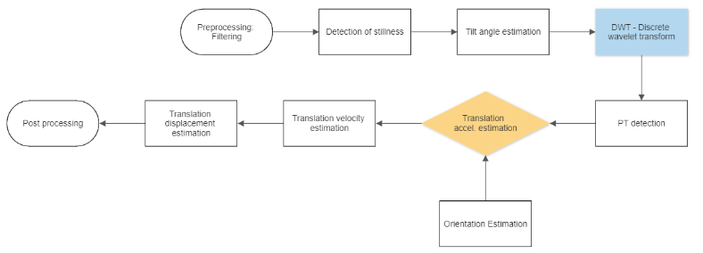
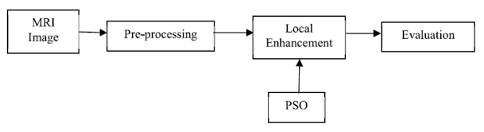
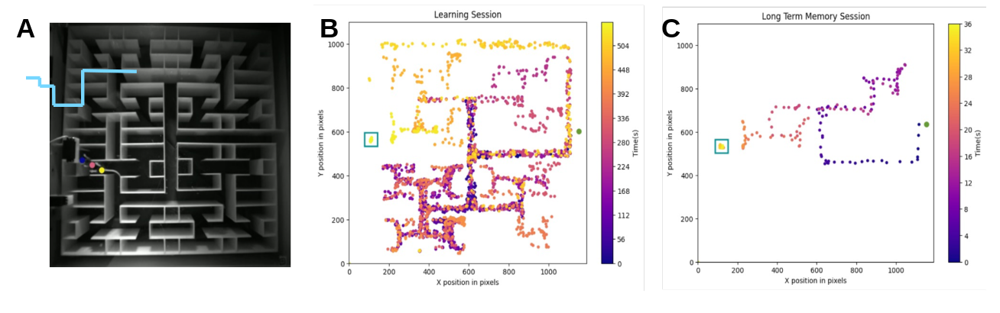

# Hackathon Projects

## [1] Detecting Real-World Transition Between Sitting and Standing

### Prof. Jeff Hausdorff's

There is a tremendous, emerging interest in using digital measures of real-world mobility to quantify and characterize the effects of aging and neurological disease. Older adults and people with Parkinson’s disease (PD) are prone to falling when they change their postural transitions. The tasks of rising from a sitting position and sitting down after standing may be challenging, increasing the risk of falls and reducing quality of life.

The overall objective is to automatically and reliably detect sitting, standing, and transitions to and from sitting to standing from real-world recordings obtained from a wearable inertial measurement unit (IMU) placed on the lower back.

The dataset that will be used is the lower-back IMU data with 21,600 minutes hours recorded during real-world conditions and behavior.  The signals (3D accelerometers and 3D gyroscope) are composed of ~708 transitions and ~6870 minutes of sitting time and are accompanied by “gold standard” labels of the subject’s state (e.g., sitting, standing, or walking).

Goals:
* Translate “transition” detecting code from Matlab into Python.
* Determine the performance (e.g., accuracy, sensitivity, specificity) in identifying transitions from standing to sitting and infer state durations.

:star: Extra challenge: improve the performance of the algorithm and/or reproduce it without using the gyroscope signals.

# [2] Enhancing Magnetic Resonance Images of Brain Glioblastomas

## Dr. Amiram Moshaiov

This project is based on a 2020 article titled: [*"A Multi-Objective Enhancement Technique for Poor Contrast Magnetic Resonance Images of Brain Glioblastomas."*](https://www.sciencedirect.com/science/article/pii/S1877050920311716). MRI is a primary imaging technique for detection of brain tumors called Glioblastomas. However, quality of MRI images varies due to the patient's condition, imaging procedures, spatial resolution and the skill of the technician. Most image enhancement techniques deal with varying the intensities of the pixels; however, the image entropy or edge information is never enhanced. Contrast Limited Adaptive Histogram Equalization (CLAHE) is a widely used contrast enhancement technique that modifies only the intensity of the pixels based on the intensity of the neighboring pixels. In addition, it involves selection of the operational parameters empirically. The aforementioned paper deals with the development of an automatic multi-objective enhancement technique to enhance the
image quality in terms of entropy and edge information and not only intensity of pixels. The proposed technique shows improved results for contrast, entropy, peak SNR, structural similarity, unique image quality index and mean square error.

The following figure, which is adopted from the above paper, shows the main building blocks of the software system of that research work:

The MRI data used in the paper was taken from a free, publicly available dataset. Also, the paper includes detailed descriptions of all the building blocks of the system, which should be sufficient to imitate the entire system as in the paper. For the Hackathon it is sufficient to implement even just a part of it. Following the hackathon, if the students will be interested to extend their work into a project, the proposer will be happy to supervise them on how to implement the pareto-optimality approach which is intended to be studied using the proposed implementation.

## [3] Muse-generated EEG Data Extraction and Preprocessing

### Prof. Dino Levy

The [Muse](https://choosemuse.com/) headband captures 7 channels of EEG data to detect brain activity and provide real-time biofeedback. The goal of this project will be to create a utility application that will visualize and preprocess the raw data in preparation for further analyses (conduct standard and basic transformations, e.g. averaging over time and Fourier analysis).

## [4] Flow Image Correlation Spectroscopy (FLICS) Graphical User Interface (GUI)

### Prof. Pablo Blinder

FLICS is a novel method for extracting flow speeds in complex vessel networks from a single raster-scanned optical xy-image, acquired in vivo by confocal or two-photon excitation microscopy (see [article](https://www.nature.com/articles/srep07341)). The flow velocity is obtained by computing the Cross Correlation Function (CCF) of the intensity fluctuations detected in pairs of columns of the image.

Our lab has previously re-implemented the analysis as a reusable and efficient Python package supplemented with a [Bokeh](https://bokeh.org/-based) GUI, which is still in development. The goal of this project will be to boost the FLICS GUI package's codebase, improve functionality, solve existing issues, improve documentation, etc. The project involves interaction with a database, advanced visualizations, and collaboration on an existing package at an early stage and at a highly transient stage.

## [5] MazeMaster Package and and Graphical User Interface (GUI)

### Prof. Pablo Blinder

The MazeMaster package supports a novel version of the classic rodent maze, developed recently by the Meister lab at the California Institute of Technology. 6 correct binary turns are needed to reach the gravitation water pump which supplies a sweetened water reward. Following 3 days a
subsequent session is executed, in which the spatial memory to the reward is tested. Pose estimation of behavioral imaging data is initially analyzed using the DeepLabCut algorithm, which outputs a *.h5* data file with all of the x, y coordinates of the animal’s body parts per video frame. We are currently in the process of developing “MazeMaster” - a
Python-based library that performs downstream analysis of the behavioral data. Our motive is to receive a deeper understanding of spatial memory behavioral patterns and trajectories, as well as cleaner data resulting from velocity corrections and precise image registration.

*Figure: Long-term memory in rewarded navigation task. (A) The Complex Maze Paradigm: Mouse nose, body and tail-base are depicted in blue, red and yellow respectively. (B) Learning Session: navigation of first bout to
reward port of one mouse during the learning session. (C) Memory Session: navigation of first bout to reward port during memory session (72 hours post learning session); Blue boxes and green circles correspond to reward and entrance points respectively. Behavioral imaging data was analyzed using DeepLabCut.*

## [6] Atlas to Circle Graph

### Prof. Yaniv Assaf

In graph theory, a circle graph is the intersection graph of a chord diagram. That is, it is an undirected graph whose vertices can be associated with a finite system of chords of a circle such that two vertices are adjacent if and only if the corresponding chords cross each other ([*Wikipedia*](https://en.wikipedia.org/wiki/Circle_graph)).
Circle graphs have become an increasingly popular method of visualizing connections in complex networks generally, and in neuroscience particularly. The creation of circle graphs in Python is still poorly supported, so the objective of this project will be to create a Python package that enables users to easily generate such plots from a dataframe of atlas-based metrics.

